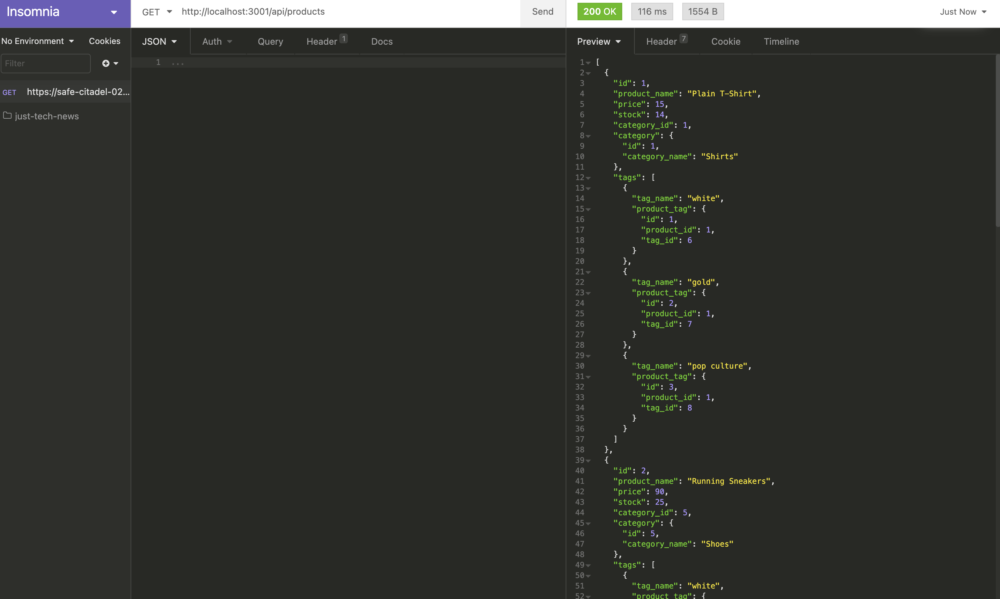
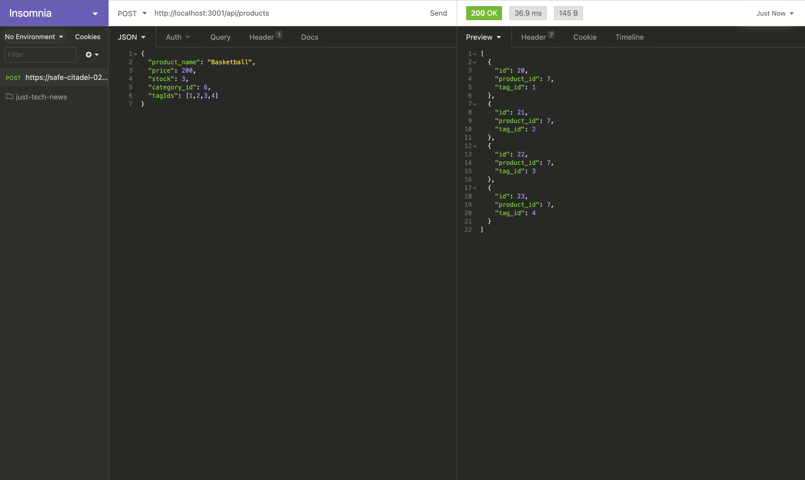
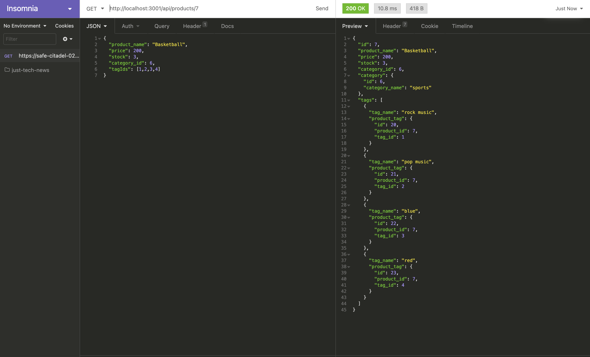

# E-Commerce Back-End 

## Description
  This command-line application is the backend of an e-commerce site. This project had starter code and took a working Express.js API and configured it to use Sequilize to interat with a MySL database.
  
  API GET, POST, PUT and DELETE routes display, create, update and delete data for categories, products and tags in my database. Data is displayed in JSON format.
  
  This project utilizes Node.js, the MySQL2 package, Sequilize package, Epxress package, and dotenv package. The GET, POST, PUT and DELETE routes were illustrated in Insomnia Core.

## Installation
  Clone the repository to your terminal. Intall Node.js to your terminal. Install MySQL2, Sequelize, Express and dotenv packages to the root of your project directory. When you star the application go into mysql and type source schema.sql and source seeds.sql for initial creation of the database and tables and to provide seed the application with mock data. To run the application, type node server.js from the root of your directory. You can use Insomnia Core to run the Get, Post, Put and Delete methods on the data.

## Screenshots of terminal application 

## Usage
  [Link to E-Commerce Back-End application walk-through video Part 1](https://drive.google.com/file/d/1nQEDAgLkIct5xOc0sfg9iBd4K-h12Ey3/view) 

  [Link to E-Commerce Back-End application walk-through video Part 2](https://drive.google.com/file/d/1NDhD521c0Ze9k9MjnLVp64bgeJiIrSts/view) 

## License  
  
Licensed under the The MIT License (the "License");
you may not use this file except in compliance with the License.
You may obtain a copy of the License at

(https://opensource.org/licenses/MIT)

Unless required by applicable law or agreed to in writing, software
distributed under the License is distributed on an "AS IS" BASIS,
WITHOUT WARRANTIES OR CONDITIONS OF ANY KIND, either express or implied.
See the License for the specific language governing permissions and
limitations under the License.
  

    